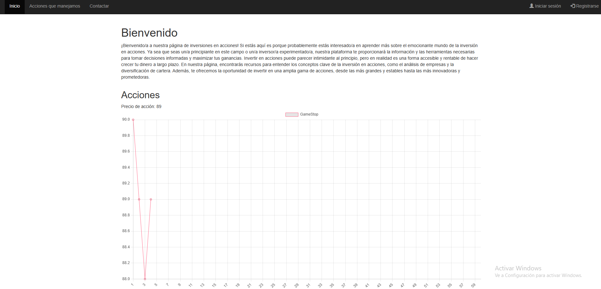
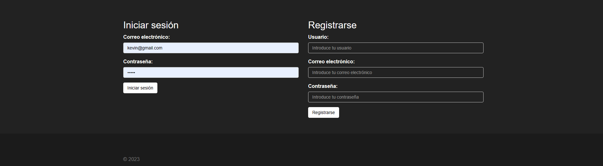
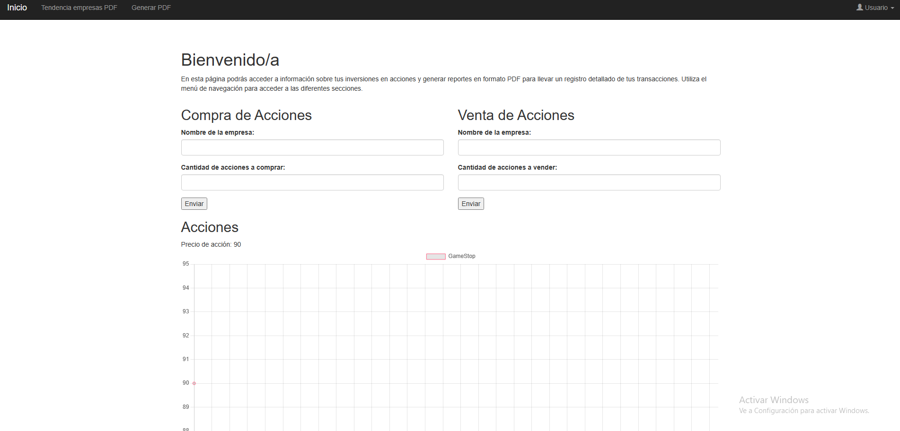
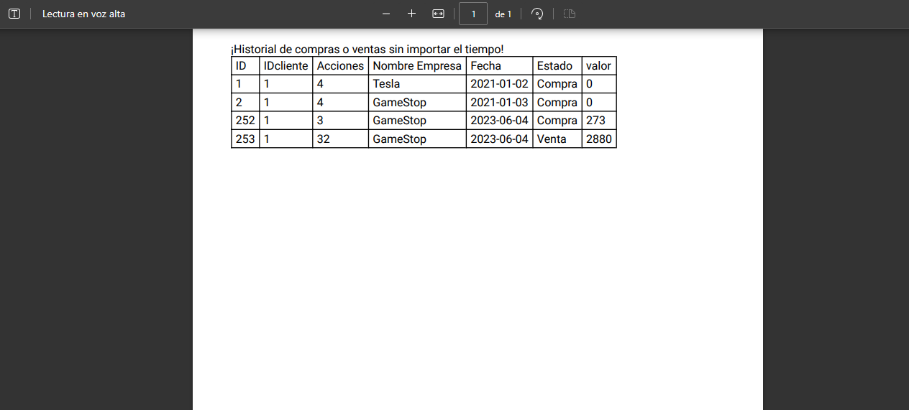
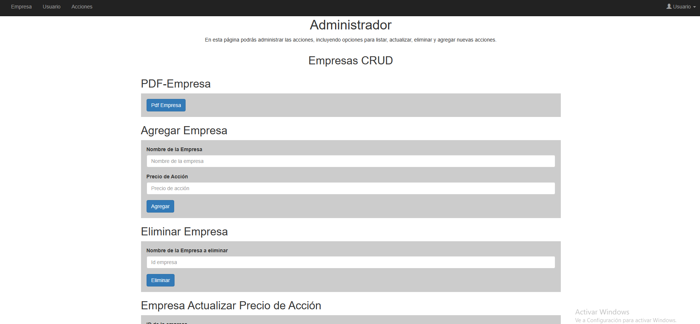
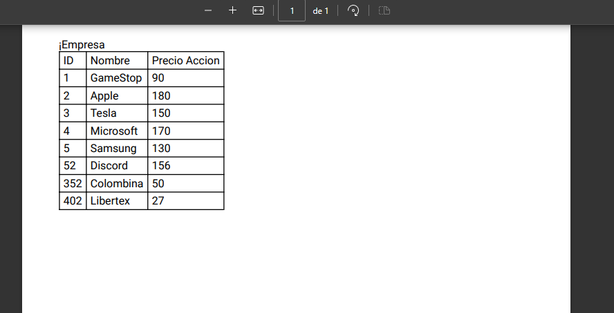

# Acciones-Fronend

Este repositorio contiene el código fuente del frontend de nuestra página web de acciones. El frontend es la parte visual de la aplicación y se encarga de interactuar con el backend para obtener, guardar, actualizar y mostrar la información necesaria.

## Características

- Tiene un apartado de administrador que puede generar pdf y su crud correspondiente con Email: admin@gmail.com y Contraseña: admin  .
- El administrador puede agregar nuevas empresas para invertir
- El usuario puede comprar o vender sus acciones, tambien puede ver su historial de comprar y ventas sin importar el tiempo.
- El usuario puede ver la tendencia las empresas.

## Capturas de Pantalla

    
   
    
    
    
      

## Instalación

Necesitas tomcat 10.1 para que sea ejecutado

## Contacto

Kevin Gonzalez- revkelo
